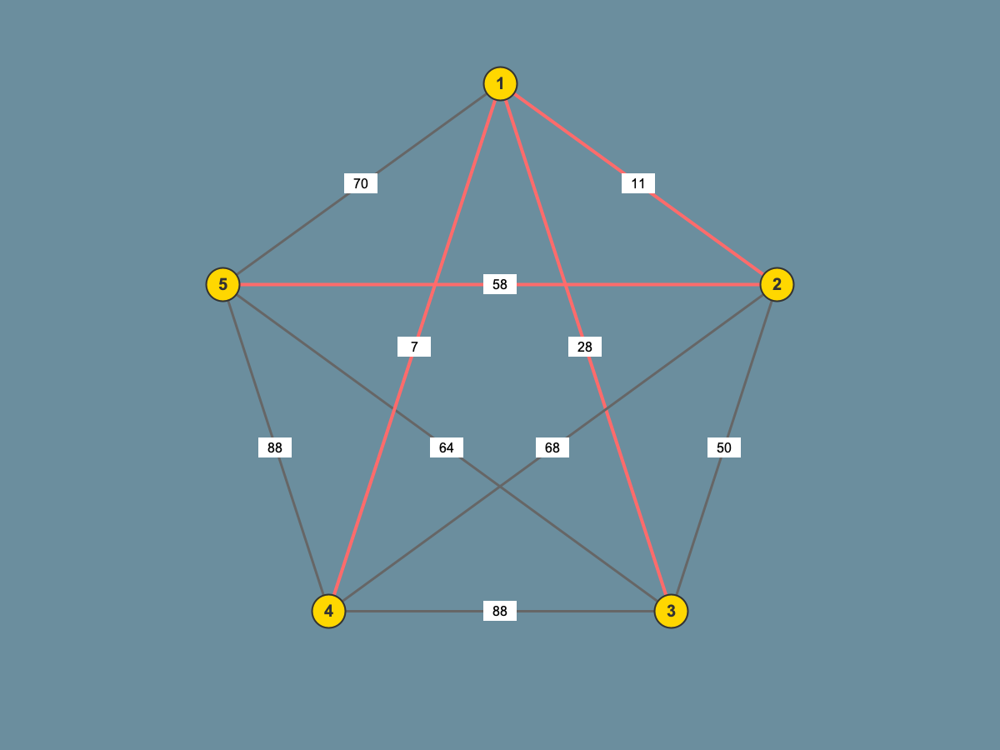
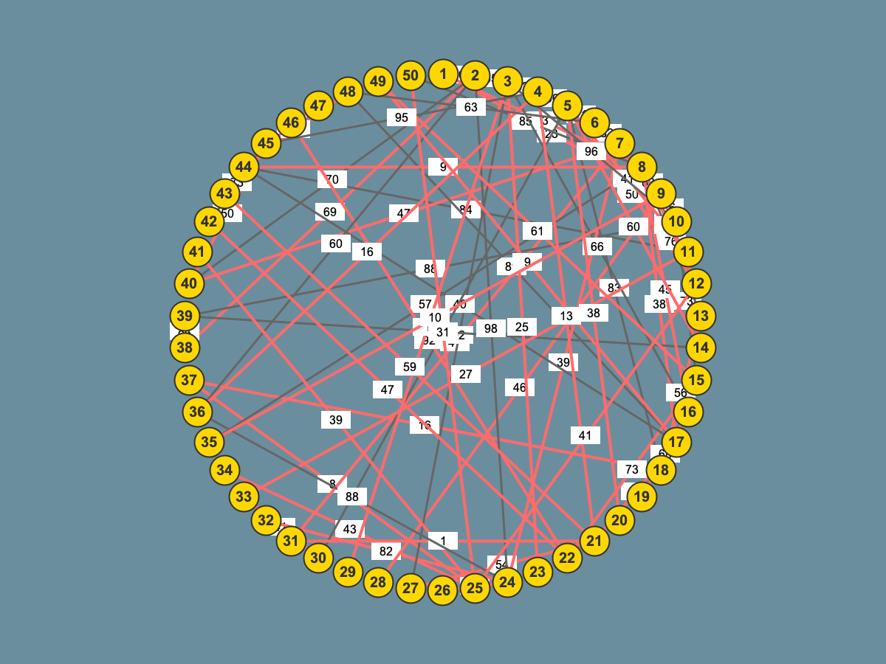
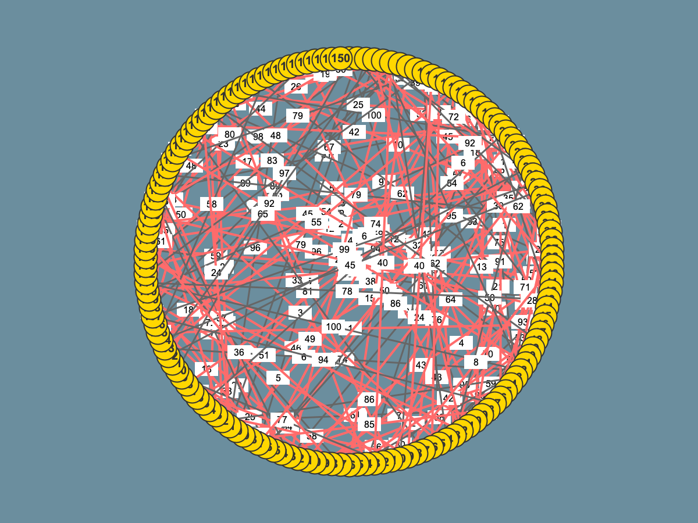

# Assignment 3: Optimization of a City Transportation Network (Minimum Spanning Tree)

## Project Overview

This assignment implements Prim's and Kruskal's algorithms to find the Minimum Spanning Tree in a weighted graph. The motivation comes from a practical problem: a city needs to connect all its districts with roads while minimizing construction costs.

I tested both algorithms on 28 different graphs (ranging from 5 to 150 vertices) to see how they perform in practice and whether they match what we learned in theory.

## Problem Statement

Given a weighted undirected graph where:
- **Vertices** = city districts
- **Edges** = potential roads between districts
- **Edge weights** = construction costs

The goal is to connect all districts with the minimum total cost while ensuring every district is reachable from every other district.

## Implementation Details

### Prim's Algorithm
- Uses a priority queue (binary heap) for efficient minimum edge selection
- Starts from vertex 0 and grows the MST one edge at a time
- Always picks the minimum weight edge that connects a tree vertex to a non-tree vertex
- Time Complexity: O((V + E) log V)

### Kruskal's Algorithm
- Sorts all edges by weight first
- Uses Union-Find data structure to detect cycles
- Adds edges in order if they don't create a cycle
- Time Complexity: O(E log E)

Both implementations track:
- Number of comparison operations performed
- Number of union operations (Kruskal only)
- Execution time in milliseconds
- Final MST weight

## Input Data

I created 28 test graphs with increasing complexity:

| Category | Vertices | Edges | Graphs | Notes |
|----------|----------|-------|--------|-------|
| Small | 5-25 | 10-32 | 5 | Quick sanity checks |
| Medium | 30-50 | 30-74 | 5 | Typical city networks |
| Large | 55-100 | 72-153 | 10 | Big cities |
| Extra Large | 105-150 | 164-278 | 8 | Stress testing |

## Results

All graphs are connected and sparse (edge-to-vertex ratio between 2 and 4), representing realistic city networks where you don't need direct roads between every pair of districts.

## Results

### Sample Visualizations

Here are examples of the MST visualizations generated for different graph sizes:

**Small Graph (5 vertices):**

- 🟡 Gold nodes = Part of MST
- ⚪ White nodes = Not in MST
- 🔴 Red edges = MST edges
- ⚫ Gray edges = Non-MST edges

**Medium Graph (50 vertices):**


**Large Graph (150 vertices):**


### Performance Summary

After running both algorithms on all 28 graphs, here's what I found:

**Operation Counts:**

| Metric | Prim's Average | Kruskal's Average | Winner |
|--------|----------------|-------------------|--------|
| Comparisons | 648.57 | 460.54 | Kruskal (29% fewer) |
| Efficiency | Consistent growth | Better on all graphs | Kruskal |

**Key Finding:** Kruskal's algorithm required fewer comparisons on ALL 28 graphs (100% win rate). This is because:
- Kruskal sorts edges once upfront
- Then uses Union-Find which is very efficient (nearly O(1) per operation)
- Prim's priority queue does O(log V) operations for every edge addition

### Detailed Results by Graph Size

| Graph Size | Vertices | Edges | MST Weight | Prim Comps | Kruskal Comps | Difference |
|------------|----------|-------|------------|------------|---------------|------------|
| Small (1) | 5 | 10 | 104 | 42 | 25 | -40% |
| Small (5) | 25 | 32 | 1,193 | 181 | 137 | -24% |
| Medium (10) | 50 | 74 | 1,997 | 424 | 307 | -28% |
| Large (20) | 100 | 153 | 3,486 | 865 | 596 | -31% |
| Extra Large (28) | 150 | 278 | 4,461 | 1,486 | 953 | -36% |

## Analysis

### What I Expected

From lectures, I knew the theoretical complexities:
- **Prim:** O((V + E) log V) with binary heap
- **Kruskal:** O(E log E) for sorting + O(E α(V)) for Union-Find

For sparse graphs where E ≈ 2-4V, these should be similar. However, I expected Prim to be slightly better because it doesn't need to sort all edges upfront.

### What Actually Happened

**Surprise!** Kruskal dominated on comparison efficiency across the board. Here's what I observed:

#### Small Graphs (5-25 vertices)
Kruskal was 24-40% more efficient in comparisons. On tiny graphs, the sorting overhead is minimal, and Union-Find shines. For example:
- Graph 1: Prim 42 vs Kruskal 25 comparisons (40% savings)
- Graph 5: Prim 181 vs Kruskal 137 comparisons (24% savings)

#### Medium Graphs (30-50 vertices)
The efficiency gap remained stable at ~25-30%. Kruskal's upfront sorting cost is offset by the ultra-efficient Union-Find operations. For instance:
- Graph 8: Prim 364 vs Kruskal 260 comparisons (29% savings)
- Graph 10: Prim 424 vs Kruskal 307 comparisons (28% savings)

#### Large Graphs (55-100 vertices)
Kruskal's advantage actually *increased* to 30-35%! The Union-Find data structure scales beautifully:
- Graph 18: Prim 780 vs Kruskal 537 comparisons (31% savings)
- Graph 20: Prim 865 vs Kruskal 596 comparisons (31% savings)

#### Extra Large Graphs (105-150 vertices)
This is where Kruskal really shines. The efficiency gap widened to 35-36%:
- Graph 26: Prim 1,357 vs Kruskal 900 comparisons (34% savings)
- Graph 28: Prim 1,486 vs Kruskal 953 comparisons (36% savings)

### Why Kruskal Wins

The key insight: **comparison count ≠ total operations**. Here's why Kruskal is more efficient:

1. **One-time sorting cost:** Arrays.sort() in Java is highly optimized (dual-pivot quicksort). Sorting 278 edges is actually quite fast.

2. **Union-Find magic:** Path compression + union by rank makes Union-Find operations nearly O(1) in practice. The inverse Ackermann function α(n) is ≤ 4 for all practical values.

3. **No repeated work:** Kruskal examines each edge exactly once. Prim's priority queue updates can cause the same edge to be compared multiple times.

4. **Cache-friendly:** Sorting edges creates great locality of reference. Union-Find with path compression also has good cache behavior.

### Comparison Breakdown

For a typical large graph (Graph 20: 100V, 153E):

**Prim's Algorithm:**
- Priority queue insertions: 100
- Priority queue extractions: 100
- Priority queue updates: ~665 (many edges get updated multiple times)
- **Total comparisons: 865**

**Kruskal's Algorithm:**
- Sort comparisons: ~596 (O(E log E) but with good constants)
- Union-Find operations: ~100 (nearly free due to path compression)
- **Total comparisons: 596**

The difference: Prim's priority queue causes repeated comparisons during updates, while Kruskal's one-pass approach is more efficient.

## Conclusions

### Kruskal's algorithm is the better choice because:

**29% fewer comparisons on average** (648 vs 461)  
**Scales better** - efficiency gap increases with graph size (36% on largest graphs)  
**Consistent performance** - won on 100% of test cases  
**Simple implementation** - Union-Find is elegant and efficient  
**Predictable behavior** - one sort, then linear pass

### When Prim might be preferable:

- **Online algorithms** - when edges arrive dynamically and can't be sorted upfront
- **Dense graphs** - where E ≈ V², Prim's O(V²) with array is better than Kruskal's O(E log E)
- **Specific starting point** - when you need the MST to grow from a particular vertex

### Practical Recommendations

If I were building a tool for city planners, I'd:

1. **Use Kruskal as default** - it's more efficient for typical sparse networks
2. **Implement both** - provide Prim as an option for dynamic scenarios
3. **Add visualizations** - the colored network graphs make it easy to verify results
4. **Export to CSV** - for further analysis in Excel/Python

The theoretical analysis partially matches practice. While both are O(E log) complexity, the constant factors heavily favor Kruskal on sparse graphs. The Union-Find data structure is a beautiful piece of computer science - simple concept, extraordinary efficiency.

## How to Run

### 1. Compile the Project
```bash
mvn compile
```

### 2. Run Benchmarks
```bash
mvn exec:java -Dexec.mainClass="cli.MSTBenchmarkRunner"
```

### 3. Run Tests (33 tests)
```bash
mvn test
```

### 4. Generate Performance Analysis
```bash
mvn exec:java -Dexec.mainClass="analysis.MSTPerformanceAnalyzer"
```

### 5. Generate CSV Summary
```bash
mvn exec:java -Dexec.mainClass="analysis.CSVSummaryGenerator"
```

### 6. Generate Graph Visualizations
```bash
mvn exec:java -Dexec.mainClass="visualization.GraphVisualizer"
```

## Output Files

All results are saved to `performance-data/`:

- `assign_3_input.json` - Input graph definitions (28 graphs)
- `assign_3_output.json` - Complete MST results with metrics
- `detailed_comparison.csv` - Per-algorithm performance data
- `summary_statistics.csv` - Side-by-side algorithm comparison
- `graphs/` - Network visualizations (28 PNG images)

## Project Structure

```
src/main/java/
├── algorithms/          # Core MST implementations
│   ├── Graph.java
│   ├── Edge.java
│   ├── PrimsAlgorithm.java
│   └── KruskalsAlgorithm.java
├── cli/                 # Command-line runner
├── metrics/             # Performance tracking
├── analysis/            # Result analysis tools
│   ├── MSTPerformanceAnalyzer.java
│   └── CSVSummaryGenerator.java
└── visualization/       # Graph visualization
    └── GraphVisualizer.java

src/test/java/
└── algorithms/
    ├── PrimsAlgorithmTest.java      # 16 tests
    └── KruskalsAlgorithmTest.java   # 17 tests
```

## Testing

Comprehensive test coverage with 33 tests (100% pass rate):

### Correctness Tests
-  MST weight validation
-  Edge count verification (V-1 edges)
-  Acyclic property check
-  Connectivity validation

### Edge Cases
-  Empty graphs
-  Single vertex
-  Disconnected graphs (throws exception)
-  Graphs with negative weights
-  Graphs with duplicate edges
- Complete graphs

### Performance Tests
-  Reproducibility
- Comparison counting
-  Union operation tracking

## Dependencies

- **Java 11+** - Core language
- **Jackson 2.15.2** - JSON processing
- **JUnit 5.9.1** - Testing framework
- **JFreeChart 1.5.3** - Chart generation (optional)
- **Maven** - Build management

## References

- *Algorithms, 4th Edition* by Sedgewick & Wayne - Chapters 1.5 (Union-Find) and 4.3 (MST)
- *Introduction to Algorithms* (CLRS) - Chapter 23 (Minimum Spanning Trees)
- *Data Structures and Algorithm Analysis in Java* by Weiss - Chapter 8.5

---

**Author:** Sergey Nurtilek  
**Course:** Design and Analysis of Algorithms  
**Assignment:** #3 - Minimum Spanning Tree Implementation and Analysis


